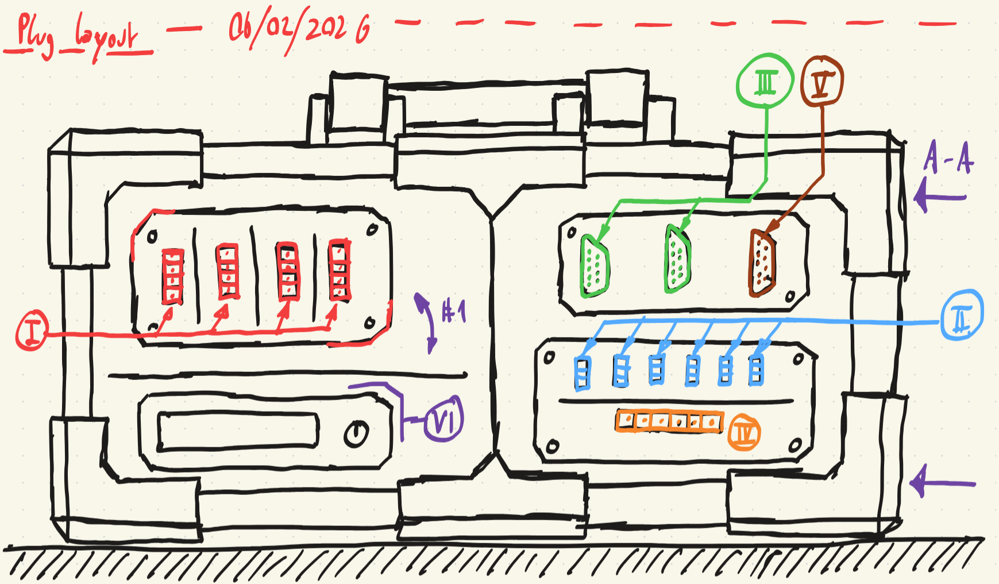

# RDX - Robot Driver X 

    

_(Early demo sketch)_

The RDX is the continuation of a series of robot drivers, this time as a clean, portable suitcase format. The driver features a set of plugs for each purpose
that make setting up and transport easy.

## Features

- 4 STEPPER drivers for 24-36V with up to 4A
- 6 SERVO connectors
- 2 GPIO plugs for end-switches and other input/output means
- 1 MISC plug exposing diverse bus systems and further GPIOs
- 1 POWER plug, granting high-power access to the system voltages 5V, 12V and 24V/36V 

## Circuit diagram

An up-to-date circuit diagram can be viewed [here](/electronics/output/RDX.pdf). It contains detailed information about:

- Power wiring and maximum amperages
- Detailed wiring of the plugs and their respective pin connections to the Raspberry Pi